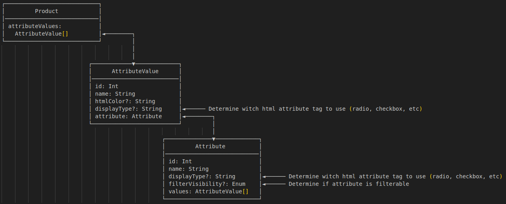

# ODOO + Alokai Storefront

This is a demo project that guides the creation of a Nuxt-based E-commerce project using Alokai (formerly Vue Storefront) integrated with the ODOO ERP.

## 📚 Table of Contents

- [Overview](#overview)
- [Main Pages](#main-pages)
- [Dynamic Routing System](#dynamic-routing-system)
  - [Automatic Route Generation](#automatic-route-generation)
  - [Route Resolver](#route-resolver)
- [Key Features](#key-features)
  - [Product Search](#product-search)
  - [Advanced Caching System](#advanced-caching-system)
  - [Payment Integration](#payment-integration)
  - [Product Features](#product-features)
  - [Category System](#category-system)
- [Tech Stack](#tech-stack)
- [Project Structure](#project-structure)
- [ODOO Integration](#odoo-integration)
  - [Core E-commerce Concepts](#core-e-commerce-concepts)
  - [Data Structure in Practice](#data-structure-in-practice)
  - [Key Integration Patterns](#key-integration-patterns)
  - [Categories and Navigation](#categories-and-navigation)
  - [Cart and Order Management](#cart-and-order-management)
  - [SEO and URL Structure](#seo-and-url-structure)
  - [Performance Optimizations](#performance-optimizations)
- [Setup and Installation](#setup-and-installation)


## Overview

The project uses the Alokai SDK to create a modern and high-performance e-commerce experience, directly connected to ODOO as the backend ERP.

## Main Pages

The core of the Alokai e-commerce used in this project includes the following pages:

- **🏠 Home** (/) - Homepage with featured products
- **📂 Category** (/category-page) - Dynamic category pages listing by category slug
- **📦 Product** (/product-page) - Dynamic product pages listing by product slug
- **🛒 Cart** (/cart) - Shopping cart
- **💳 Checkout** (/checkout) - Checkout process
- **❤️ Wishlist** (/wishlist) - Wishlist page
- **👤 My Account** (/my-account) - Customer area with:  
  - 📍 Addresses (/billing-details or /shipping-details)
  - 📝 Personal information (/personal-data)

## Dynamic Routing System

### ⚡ Automatic Route Generation
The project uses an advanced dynamic route generation system that:

- **🔄 Automatic fetch from ODOO**: During build time, the system queries ODOO via GraphQL to fetch all slugs for products, categories, and website pages
- **📄 Static route creation**: Automatically generates static pages for each product and category found
- **⚡ Performance optimization**: Applies automatic SWR (Stale-While-Revalidate) configurations to each generated route
- **🔗 Real-time route resolution**: `/api/route-resolver` API endpoint that identifies the content type based on the URL slug

### 🔀 Route Resolver
An intelligent system that:
- 🎯 Identifies, at runtime, whether a route matches a product, category, or website page
- 🗄️ Uses Redis cache to optimize lookups
- 🗺️ Maps ODOO models to route types:
  - `product.template` → 📦 product
  - `product.public.category` → 📂 category  
  - `alokai.website.page` → 📄 website page

## Key Features

### 1. 🔍 Product Search

- **🏪 ODOO Default**: Native ODOO search accessible via the header search bar
- **🔍 Algolia**: Integration with Algolia for advanced search and suggestions
- **🔍 Luigi**: Alternative search system using Luigi

### 2. 🗄️ Advanced Caching System

- **🔗 Route Cache**: Optimizes resources by reducing unnecessary API calls
- **📄 Page Cache**: HTML caching to improve user experience and performance
- **💾 Storage Layers**: Multi-driver storage system (Redis) for:
  - 🛒 Cart cache
  - 📦 Stock cache
  - 🔗 Slug/route cache
  - 📊 General data cache

### 3. 💳 Payment Integration

- **💰 Adyen Payment**: Secure and fast payment processing using the Adyen platform

### 4. 📦 Product Features

- **🎨 Dynamic Variants**: Size, color, and material selection with automatic URL update
- **🖼️ Image Gallery**: Gallery system with thumbnails and main image
- **🔗 Related Products**:
  - 🛍️ Frequently bought together
  - 🔄 Alternative products
  - 👀 Recently viewed
- **❤️ Wishlist**: Add/remove products from wishlist
- **📊 Stock Management**: Real-time stock availability check

### 5. 📂 Category System

- **🔍 Filter Navigation**: Sidebar with attribute filters
- **📄 Pagination**: Responsive pagination system
- **🍞 Breadcrumbs**: Hierarchical navigation
- **📱 Responsive View**: Automatic adaptation for mobile and desktop

## 🛠️ Tech Stack

- **🚀 Framework**: Nuxt 3
- **🎨 UI Components**: Alokai Storefront UI
- **🏪 Backend**: ODOO ERP
- **💅 Styling**: Tailwind CSS 3
- **⚡ Build Tool**: Vite
- **🗄️ Cache**: Redis (configurable via storage drivers)
- **🖼️ Images**: Nuxt Image with custom ODOO provider

## 📁 Project Structure (Main paths)

```
├── layers/                       # Nuxt layers for modular architecture
│   ├── cart-redis/              # Cart management with Redis caching
│   │   ├── composables/         # Cart-related composables
│   │   └── server/              # Cart server utilities and plugins
│   ├── category/                # Category pages and functionality
│   │   ├── composables/         # Category-related composables
│   │   ├── custom-pages/        # Category page templates (dynamic page routing by categories slug)
│   │   └── utils/               # Category utilities│   
│   ├── core/                    # Core application components
│   │   ├── components/          # Shared UI components
│   │   │   ├── header/          # Header components (Mobile/Desktop)
│   │   │   └── ui/              # Base UI components
│   │   └── composables/         # Core composables│   
│   ├── product/                 # Product pages and functionality
│   │   ├── composables/         # Product-related composables
│   │   └── custom-pages/        # Product page templates (dynamic page routing by products slug)
│   └── search-default/          # Search functionality
│       ├── components/          # Search components
│       ├── composables/         # Search composables
│       └── pages/               # Search page
├── modules/                     # Custom Nuxt modules
│   └── routes-generator/        # Automatic route generator
├── server/                      # Server API routes and middleware
    ├── api/                     # API endpoints
    ├── mutations/               # GraphQL mutations
    └── queries/                 # GraphQL queries

```

## ODOO Integration

The project is configured to integrate with the ODOO ERP using GraphQL APIs. Understanding ODOO's e-commerce data model is crucial for effective development.

### Core E-commerce Concepts

#### Product Template vs Product Variant

**Product Template**
- Represents the **main product** with shared characteristics
- Contains general information like name, description, category, and base price
- Serves as a container for multiple variants
- Used for SEO, URLs, and product pages

**Product Variant**
- Represents a **specific variation** of a product template
- Created by combining different attribute values (size, color, material)
- Each variant has its own stock, price, and SKU
- Used for cart operations and inventory management

```typescript
// Example: A T-shirt Product Template can have variants like:
// - Red T-shirt Size M
// - Blue T-shirt Size L
// - Green T-shirt Size S
```

#### Product Attributes Architecture

**Attributes (`product.attributeValues`)**
- Define variant dimensions like "Color", "Size", "Material"
- Control how variants are created and displayed
- Configure filter visibility and display types

**Attribute Values (`product.attribute.value`)**
- Specific values like "Red", "Large", "Cotton"
- Combined to create unique product variants
- Can have price extras and HTML colors for UI display

### Data Structure in Practice

#### Product Template Structure
```typescript
interface ProductTemplate {
  id: number
  name: string
  slug: string
  description: string
  image: string
  firstVariant: ProductVariant        // Default variant for display
  attributeValues: AttributeValue[]   // Available variant options
  breadcrumb: BreadcrumbItem[]
  // SEO fields
  metaTitle: string
  metaDescription: string
  jsonLd: object
}
```

#### Product Variant Structure
```typescript
interface ProductVariant {
  id: number
  name: string  
  combinationInfoVariant: PriceInfo   // Variant-specific pricing
  stock: number                       // Real-time stock from Redis
  // Variant-specific attributes
  attributeValueIds: number[]
}
```

#### Pricing Logic
```typescript
interface CombinationInfoVariant {   
  list_price: number        // Regular/original price
  price: number            // Current/special price
  has_discounted_price: boolean  // If true indicates a special price is applied
}

// Price calculation priority:
// 1. combinationInfoVariant.price (variant special price)
// 2. combinationInfoVariant.list_price (variant regular price)
```

#### Stock Management
- Real-time stock stored in Redis cache
- Stock quantity updated according cart operations. More informations [`here`](https://docs.alokai.com/integrations/odoo)
- Stock checks prevent overselling


### 🔄 Key Integration Patterns

#### 1. Product Loading Strategy
```typescript
// Load template first for general info and SEO
const { productTemplate } = useProductTemplate(slug)

// Load specific variant based on URL attributes
const { productVariant } = useProductVariant(fullPath)
```

#### 2. Variant Selection Flow
```typescript
// URL structure: /product-slug?Color=1&Size=2&Material=3
// Each query parameter maps to an attribute value ID
const params = {
  combinationId: [1, 2, 3], // Attribute value IDs
  productTemplateId: productTemplate.id
}
```

#### 3. Filter resolution flow 

- On category page load:

    A list of Products is fetched.

    Each Product contains attributeValues, which point to Attributes.

- To render filters:

    Unique Attributes are extracted from all attributeValues.

    Only Attributes with filterVisibility enabled are shown.

    Filters can be displayed as swatches, color pickers, checkboxes, etc., based on displayType.

#### 4. Example filter ui State

```javascript
// Extracted from products in the current category
const filters = [
  {
    id: 12,
    name: 'Color',
    displayType: 'color',
    options: [
      { id: 1, name: 'Red', htmlColor: '#f00' },
      { id: 2, name: 'Blue', htmlColor: '#00f' }
    ]
  },
  {
    id: 13,
    name: 'Size',
    displayType: 'text',
    options: [
      { id: 3, name: 'S' },
      { id: 4, name: 'M' },
      { id: 5, name: 'L' }
    ]
  }
]

/**Notes:

    The same AttributeValue IDs are used in:

        Filters on the category page (for product discovery)
        Variant selection on the product detail page (for combination resolution)

    This allows consistent behavior between discovery and selection.
**/
```

#### 5. Entity Relationship Overview



### Categories and Navigation

**Product Categories (`product.public.category`)**
- Hierarchical structure with parent/child relationships
- SEO-optimized with slugs and meta information
- Support breadcrumb navigation and filtering

### Cart and Order Management

**Cart Operations (add/remove/update qty)**
- Always use **Product Variant ID** for cart operations
- Variants ensure accurate pricing and stock validation
- Cart items stored as [`OrderLine`](graphql/types.ts) objects

**Order Processing**
- Orders contain multiple order lines
- Each line references a specific product variant
- Supports discounts, coupons, and gift cards

### SEO and URL Structure

- **Product Templates**: `/product-slug` (base product page)
- **Product Variants**: `/product-slug?Color=1&Size=2` (specific variant)
- **Categories**: `/category-slug` (category listing)
- **Search**: Integrated with ODOO native search, Algolia, or Luigi

### Performance Optimizations

- **Redis Caching**: Stock, prices, and route resolution
- **Static Generation**: Pre-built product and category pages
- **SWR Strategy**: Stale-while-revalidate for dynamic content
- **Lazy Loading**: Component-level loading strategies


## ⚙️ Setup and Installation

```bash
# Install dependencies
npm install

# Configure environment variables
cp .env.example .env

# Run in development mode
npm run dev

# Build for production
npm run build
```

For detailed technical implementation, take a look at our main documentation at [docs.alokai.com](https://docs.alokai.com/integrations/odoo).